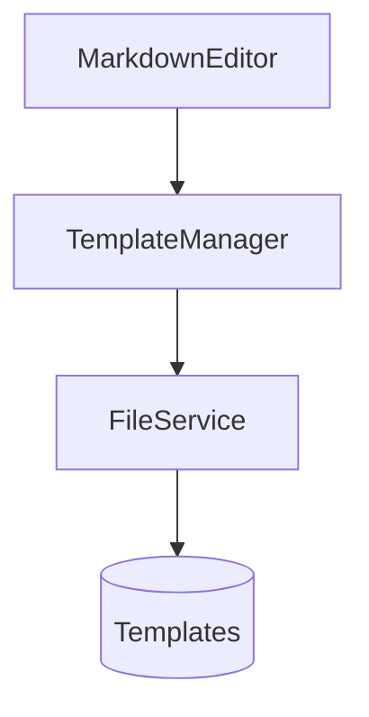

# Template Feature Implementation Plan

## UI Integration
- Add dropdown to MarkdownEditor.js
- Dynamic template loading from /templates/
- Immediate activation on selection

## File Structure
```yaml
/templates/
  ├── t123_creative-writing.yml
  └── t456_lesson-plan.yml
```

## Template Validation
1. Filename pattern: `[id]_[name].yml`
2. YAML schema validation
3. UTF-8 encoding check

## Code Changes Required


## Implementation Steps
1. Create template loading API endpoint
2. Modify TemplateManager.js
3. Add dropdown UI component
4. Implement validation system
5. Update documentation